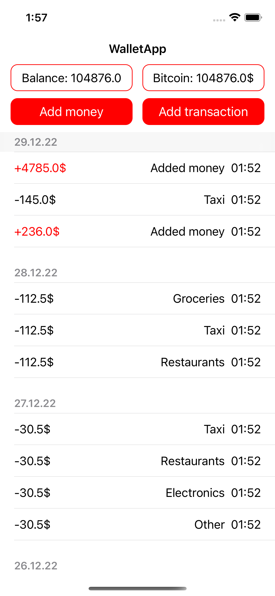
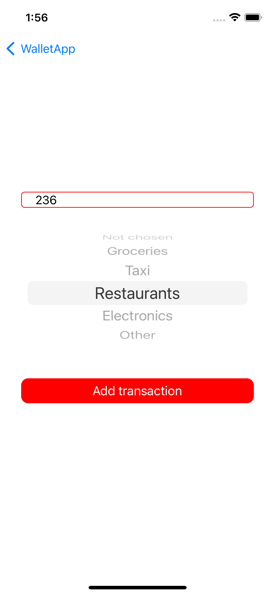
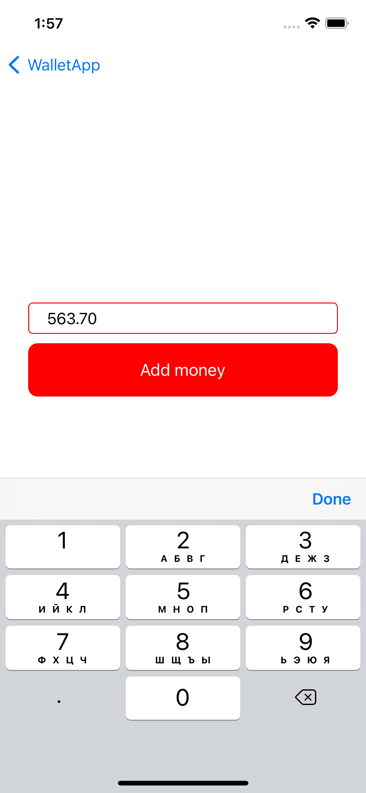
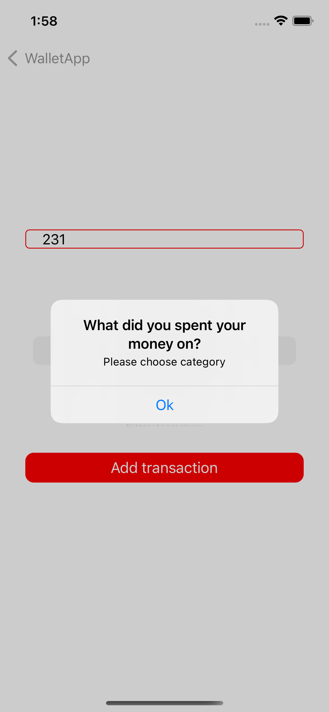

# WalletApp
### Test task

**Приложение для отслеживания движения денежных средств**

- [Примеры экранов](#screensExamples)
- [Использованные технологии](#usedTechs)

## Примеры экранов

**Главный экран**

 

**Экран добавления транзакции**

 

**Экран пополнения баланса**

 

**Алерт**

 

## Использованные технологии

1. Архитектура MVP + Coordinator
2. Localization
3. SwiftGen
4. CoreData (NSFetchedResultsController)
5. UserDefaults
6. UIKit
7. URLSession
8. GCD, async/await
9. AutoLayout
10. DI
11. POP
